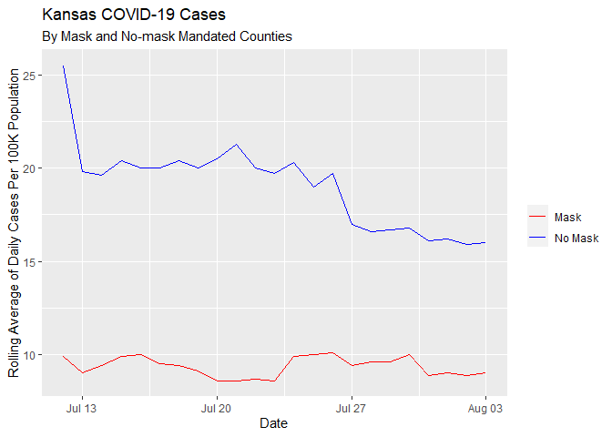

Lab 06 - Conveying the right message through visualisation
================
i_see_a\_spaceship_in_the_sky

### Load packages and data

``` r
library(tidyverse) 
library(lubridate)
```

### Exercise 1

``` r
df <- tribble(
  ~date, ~mask_count, ~no_mask_count,
  "7/12/2020", 25.5, 9.9,
  "7/13/2020", 19.8, 9,
  "7/14/2020", 19.6, 9.4,
  "7/15/2020", 20.4, 9.9,
  "7/16/2020", 20, 10,
  "7/17/2020", 20, 9.5,
  "7/18/2020", 20.4, 9.4,
  "7/19/2020", 20, 9.1,
  "7/20/2020", 20.5, 8.6,
  "7/21/2020", 21.3, 8.6,
  "7/22/2020", 20, 8.7,
  "7/23/2020", 19.7, 8.6,
  "7/24/2020", 20.3, 9.9,
  "7/25/2020", 19, 10,
  "7/26/2020", 19.7, 10.1,
  "7/27/2020", 17, 9.4,
  "7/28/2020", 16.6, 9.6,
  "7/29/2020", 16.7, 9.6,
  "7/30/2020", 16.8, 10,
  "7/31/2020", 16.1, 8.9,
  "8/1/2020", 16.2, 9,
  "8/2/2020", 15.9, 8.9,
  "8/3/2020", 16, 9
)

df <- df %>%
  mutate(date = mdy(date))

df
```

    ## # A tibble: 23 × 3
    ##    date       mask_count no_mask_count
    ##    <date>          <dbl>         <dbl>
    ##  1 2020-07-12       25.5           9.9
    ##  2 2020-07-13       19.8           9  
    ##  3 2020-07-14       19.6           9.4
    ##  4 2020-07-15       20.4           9.9
    ##  5 2020-07-16       20            10  
    ##  6 2020-07-17       20             9.5
    ##  7 2020-07-18       20.4           9.4
    ##  8 2020-07-19       20             9.1
    ##  9 2020-07-20       20.5           8.6
    ## 10 2020-07-21       21.3           8.6
    ## # … with 13 more rows

### Exercise 2

``` r
ggplot(data = df) +
  geom_line(mapping = aes(x = date, y = mask_count), color = "red")+
  geom_line(mapping = aes(x = date, y = no_mask_count), color = "blue") +
  labs(x = "Date", 
       y = "Rolling Average of Daily Cases Per 100K Population",
       title = "Kansas COVID-19 Cases",
       subtitle = "By Mask and No-mask Counties")
```

<!-- -->

### Exercise 3

*Add your narrative here.*

### Exercise 4

<<<<<<< HEAD
*Add your narrative here.*
=======
The information shows that the trend of wearing masks was at its peak at
the start of the pandemic. From this it trends downwards slowly loosing
popularity as the months continued on wards. There is a small peak along
the way which could be caused by spikes in the virus and people wanting
to be safer. The range of the amount of people who wore masks at the
start compared to the finish shows a great range going from 25.5 per
100k to begin with down to 16 per 100k, showing a range of 9.5 per 100k.
However, the number of countries that don’t wear masks (no masks) makes
a very steady line going across the graph from one side to the other
with not many increases or decreases in the number of none mask wearers.
>>>>>>> 3ff7be5664c1fc2586ce928e94ced04d9f3a94ce
